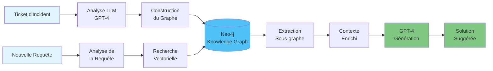
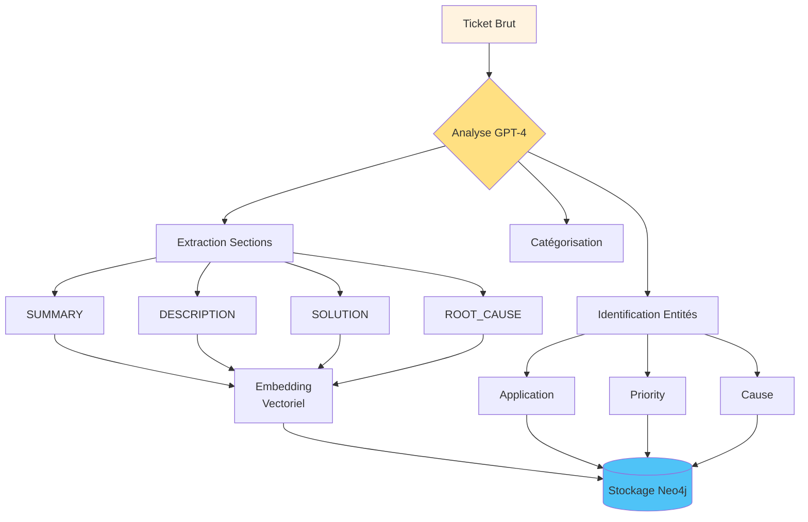
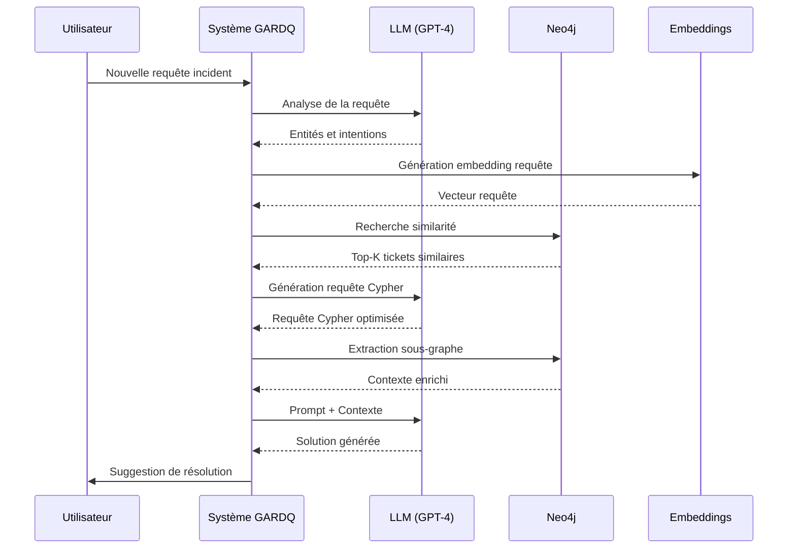
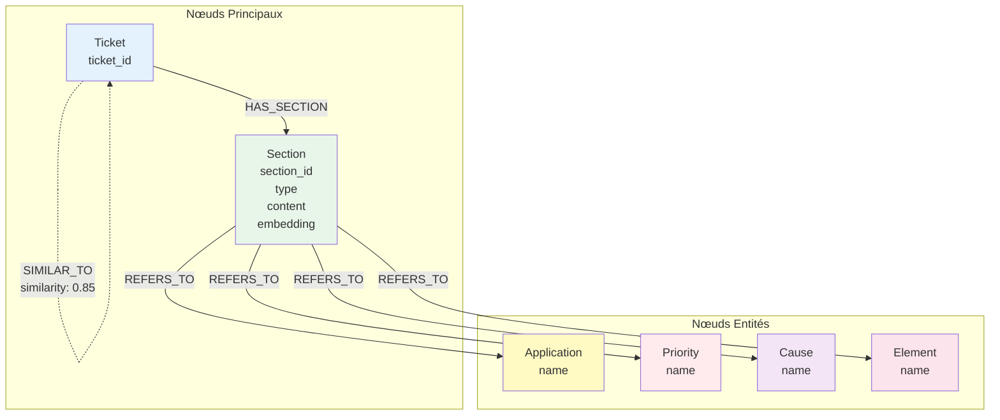
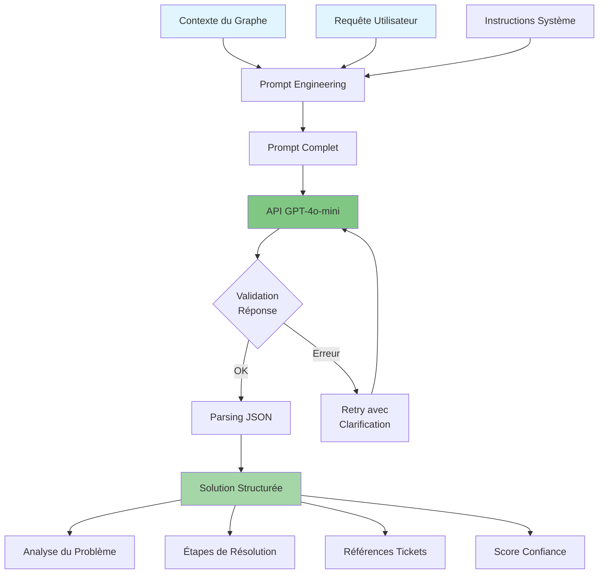
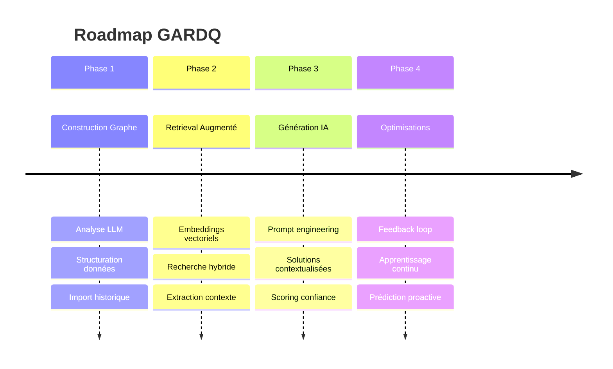

# Diagrammes Mermaid pour la Présentation GARDQ

## Workflow Global



## Construction du Graphe



## Processus de Retrieval



## Architecture de Stockage Neo4j



## Pipeline de Communication LLM



## Métriques de Performance

```mermaid
graph LR
    subgraph "Retrieval Metrics"
        A[MRR: +78.6%]
        B[Recall@5: +50%]
        C[NDCG@10: +40%]
    end
    
    subgraph "Generation Metrics"
        D[BLEU-4: 0.68]
        E[ROUGE-L: 0.74]
        F[BERTScore: 0.82]
    end
    
    subgraph "Business Impact"
        G[Resolution Time: -28.6%]
        H[First Contact: +35%]
        I[User Satisfaction: +42%]
    end
    
    style A fill:#81c784
    style B fill:#81c784
    style C fill:#81c784
    style G fill:#4fc3f7
    style H fill:#4fc3f7
    style I fill:#4fc3f7
```

## Évolution du Système



Ces diagrammes peuvent être intégrés dans votre présentation pour illustrer visuellement les différents aspects du système GARDQ.